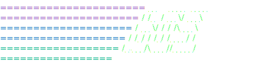

# BoredOS

  

BoredOS is a simple x86_64 hobbyist operating system. 
It features a DE (and WM), a FAT32 filesystem, customizable UI and much much more!

*this screenshot might be outdated*

## Features
- userspace
- JPG image support
- Disk manager
- Drag and drop mouse centered UI
- Customizable UI
- Basic Networking Stack
- Bored WM
- FAT32 filesystem
- 64-bit long mode support
- Multiboot2 compliant
- Text editor
- Markdown Viewer
- Minesweeper
- Markdown Viewer
- GUI Text editor
- Paint application
- IDT
- Ability to run on actual x86_64 hardware
- CLI
- (Limited) C Compiler

## Documentation

BoredOS has comprehensive documentation available in the [`docs/`](docs/) directory covering architecture, the build system, and application development SDKs.

-   **[Index / Table of Contents](docs/README.md)**
-   **[Architecture Overview](docs/architecture/core.md)**
-   **[Building and Running](docs/build/usage.md)**
-   **[Application Development Guide](docs/appdev/custom_apps.md)**

###
###

<h2 align="left">Help me brew some coffee! ☕️</h2>

###

  If you enjoy this project, and like what i'm doing here, consider buying me a coffee!
    
  

###

## This project was previously labeled as "BrewKernel"
Brewkernel was a text only very simple (and messy) project i started 3 years ago. It was my first work in OSDev and i absolutely loved it. It sadly just got too messy and i myself couldn't understand my own code anymore. About a year ago i started work on BoredOS, and pushed a *"working"* version of it a few days ago as of writing this *(Feb. 10 2026)* 
Brewkernel has already been deprecated and will not be accepting any pull requests or fix any issues as it is now a public archive.
Thanks to everyone who helped me with Brewkernel, even if it were just ideas, and intend to keep working on this for the forseeable future!

## License

Copyright (C) 2024-2026 boreddevnl

This program is free software: you can redistribute it and/or modify it under the terms of the GNU General Public License as published by the Free Software Foundation, either version 3 of the License, or (at your option) any later version.

NOTICE
------

This product includes software developed by Chris ("boreddevnl") as part of the BoredOS (Previously Brewkernel/BrewOS) project.

Copyright (C) 2024–2026 Chris / boreddevnl (previously boreddevhq)

All source files in this repository contain copyright and license
headers that must be preserved in redistributions and derivative works.

If you distribute or modify this project (in whole or in part),
you MUST:

  - Retain all copyright and license headers at the top of each file.
  - Include this NOTICE file along with any redistributions or
    derivative works.
  - Provide clear attribution to the original author in documentation
    or credits where appropriate.

The above attribution requirements are informational and intended to
ensure proper credit is given. They do not alter or supersede the
terms of the GNU General Public License (GPL), which governs this work.
