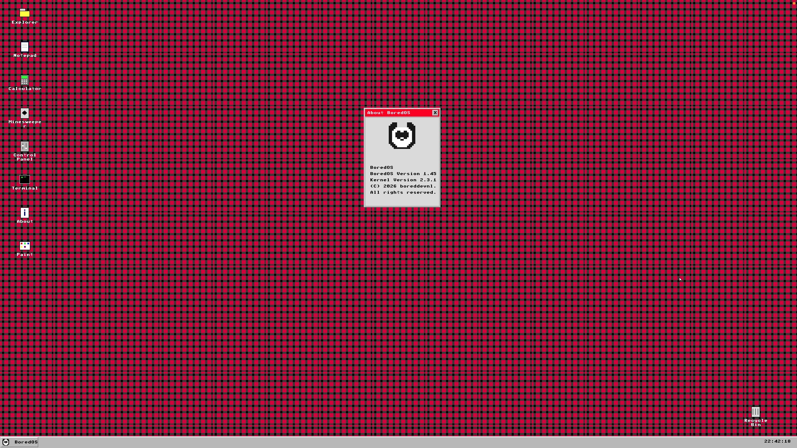

# BoredOS 1.50 Beta
BoredOS is now in a Beta stage as i have brought over all apps from brewkernel and have made the DE a lot more usable and stable.

 </br>
BoredOS is a simple x86_64 hobbyist operating system. 
It features a DE (and WM), a FAT32 filesystem, customizable UI and much much more!


*this screenshot might be outdated*

## Features
- Drag and drop mouse centered UI
- Customizable UI
- Basic Networking Stack
- Bored WM
- Fat 32 FS
- 64-bit long mode support
- Multiboot2 compliant
- Text editor
- Markdown Viewer
- Minesweeper
- Markdown Viewer
- GUI Text editor
- Paint application
- IDT
- Ability to run on actual x86_64 hardware
- CLI
- (Limited) C Compiler

## Prerequisites

To build BoredOS, you'll need the following tools installed:

- **x86_64 ELF Toolchain**: `x86_64-elf-gcc`, `x86_64-elf-ld`
- **NASM**: Netwide Assembler for compiling assembly code
- **xorriso**: For creating bootable ISO images
- **QEMU** (optional): For testing the kernel in an emulator

On macOS, you can install these using Homebrew:
```sh
brew install x86_64-elf-binutils x86_64-elf-gcc nasm xorriso qemu
```

## Building

Simply run `make` from the project root:

```sh
make
```

This will:
1. Compile all kernel C sources and assembly files
2. Link the kernel ELF binary
3. Generate a bootable ISO image (`boredos.iso`)

The build output is organized as follows:
- Compiled object files: `build/`
- ISO root filesystem: `iso_root/`
- Final ISO image: `boredos.iso`

## Running

### QEMU Emulation

Run the kernel in QEMU:

```sh
make run
```

Or manually:
```sh
qemu-system-x86_64 -m 2G -serial stdio -cdrom boredos.iso -boot d
```

### Running on Real Hardware

*Warning: This is at YOUR OWN RISK. This software comes with ZERO warranty and may break your system.*

1. **Create bootable USB**: Use [Balena Etcher](https://www.balena.io/etcher/) to flash `boredos.iso` to a USB drive

2. **Prepare the system**:
   - Enable legacy (BIOS) boot in your system BIOS/UEFI settings
   - Disable Secure Boot if needed

3. **Boot**: Insert the USB drive and select it in the boot menu during startup

**Networking requires an Intel E1000 network card or similar while using Ethernet.**

4. **Tested Hardware**:
   - HP EliteDesk 705 G4 DM (AMD Ryzen 5 PRO 2400G, Radeon Vega) **Tested, no networking.**
   - Lenovo ThinkPad A475 20KL002VMH (AMD Pro A12-8830B, Radeon R7) **Tested, no networking.**
   - Acer Aspire E5-573-311M (Intel Core i3-5005U, Intel HD Graphics) **Tested, no networking.**


## Project Structure

- `src/kernel/` - Main kernel implementation
- `boot.asm` - Boot assembly code
- `main.c` - Kernel entry point
- `*.c / *.h` - Core kernel modules (graphics, interrupts, filesystem, etc.)
- `cli_apps/` - Command-line applications
- `build/` - Compiled object files (generated during build)
- `iso_root/` - ISO filesystem layout (generated during build)
- `limine/` - Limine bootloader files (downloaded automatically)
- `linker.ld` - Linker script for x86_64 ELF
- `limine.cfg` - Limine bootloader configuration
- `Makefile` - Build configuration and targets


###
###

<h2 align="left">Help me brew some coffee! ☕️</h2>

###

<p align="left">
  If you enjoy this project, and like what i'm doing here, consider buying me a coffee!
  <br><br>
  <a href="https://buymeacoffee.com/boreddevnl" target="_blank">
    
  </a>
</p>

###


## This project was previously labeled as "BrewKernel"
Brewkernel was a text only very simple (and messy) project i started 3 years ago. It was my first work in OSDev and i absolutely loved it. It sadly just got too messy and i myself couldn't understand my own code anymore. About a year ago i started work on BoredOS, and pushed a *"working"* version of it a few days ago as of writing this *(Feb. 10 2026)* 
Brewkernel has already been deprecated and will not be accepting any pull requests or fix any issues as it is now a public archive.
Thanks to everyone who helped me with Brewkernel, even if it were just ideas, and intend to keep working on this for the forseeable future!

## License

Copyright (C) 2024-2026 boreddevnl

This program is free software: you can redistribute it and/or modify it under the terms of the GNU General Public License as published by the Free Software Foundation, either version 3 of the License, or (at your option) any later version.

NOTICE
------

This product includes software developed by Chris ("boreddevnl") as part of the BoredOS (Previously Brewkernel/BrewOS) project.

Copyright (C) 2024–2026 Chris / boreddevnl (previously boreddevhq)

All source files in this repository contain copyright and license
headers that must be preserved in redistributions and derivative works.

If you distribute or modify this project (in whole or in part),
you MUST:

  - Retain all copyright and license headers at the top of each file.
  - Include this NOTICE file along with any redistributions or
    derivative works.
  - Provide clear attribution to the original author in documentation
    or credits where appropriate.

The above attribution requirements are informational and intended to
ensure proper credit is given. They do not alter or supersede the
terms of the GNU General Public License (GPL), which governs this work.
